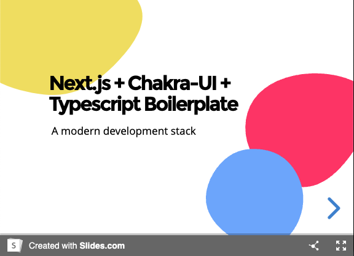
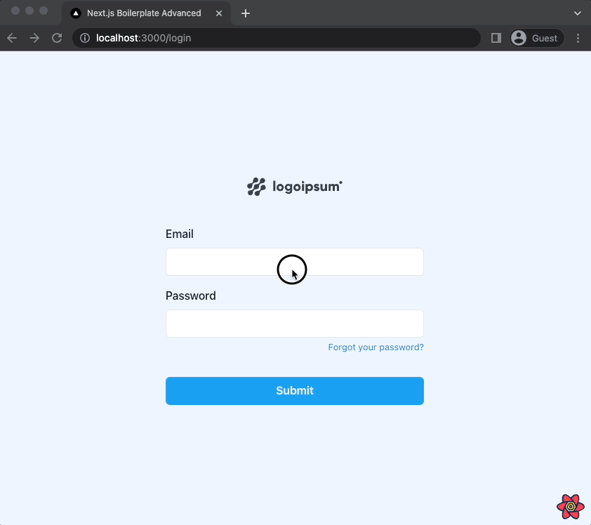

This is a [Next.js](https://nextjs.org/) project bootstrapped with [`create-next-app`](https://github.com/vercel/next.js/tree/canary/packages/create-next-app).

## Instructions

[](https://slides.com/santospatrick/nextjs-chakraui-typescript)

## Preview



## Usage

1. Initialize your project with this command:

```bash
yarn create next-app -e https://github.com/santospatrick/nextjs-boilerplate-advanced
```

2. Duplicate `.env.example` to `.env.local` fulfilling variables as needed

3. Run the following commands:
```bash
yarn install
yarn dev # start development server
```

4. Done 🎉

## Features
- [x] Authentication screens pre-built
- [x] Server side rendering
- [x] Forms (compatible with `react-hook-form`)
  - [x] Text Input (masked/normalized)
  - [x] Date Input
  - [x] Upload Input
  - [x] Autocomplete/Select Input
  - [x] Number Input
  - [x] Phone Input
  - [x] Textarea Input
  - [x] Schema validation with `yup`
- [x] Data table with inline editing
- [x] Layouts
- [x] CRUD example
- [x] Modal with fullscreen option
- [x] Email templates for authentication flow
- [x] VSCode workspace recommendations
- [x] Profile page for user editing
- [x] Collapsable & nested menu
- [ ] Advanced filter for data tables
- [ ] Form builder

## Technologies
- [x] Next.js
- [x] Typescript
- [x] Chakra UI
- [x] Next SEO
- [x] React Table
- [x] Eslint/Prettier
- [x] React Toastify
- [x] React Query
- [x] React Hook Form
- [x] NProgress
- [x] Git hooks
- [x] Perfect scrollbar
- [x] Mjml
- [x] useHooks Typescript
- [x] Utility Types
- [x] Storybook
- [ ] Code Generator

## Storybook

In order to see storybook, run development server with following command:

```bash
yarn install # if you didn't yet :)
yarn storybook # start server at http://localhost:6006
```